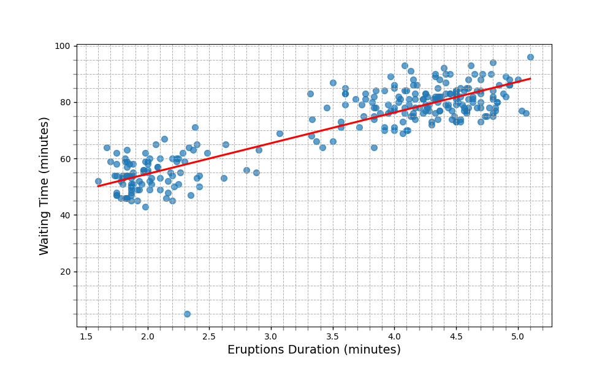

<h1 align="center">Data Analysis on Old Faithful Geyser</h1>
<h5 align="center">Codebase for Fall 2024 BMI 500 Coursework Week 4 Assignment at Emory University</h5>
<h5 align="center">Submitted by Swati Rajwal</h5>

## 🎯Objectives
The primary objective of this assignment is to demonstrate a data treatment and analysis pipeline using the Old Faithful geyser dataset. The goals are to clean and preprocess the dataset and explore the relationship between eruption duration and waiting time using statistical techniques. 

## 👩‍💻Approach
Our approach involves utilizing Python libraries to process the dataset and applying statistical techniques (Pearson correlation) to explore the relationship between given two variables.

## 📈Results

  <table>
    <tr>
      <td>
        
        
<b>Figure 1: Cleaned data distribution of (A) geyser eruption duration and (B) wait time.</b>

      </td>
      <td>
        
        
<b>Figure 2: Scatterplot with regression line (red) showing the association between eruption durations (x-axis) and waiting time (y-axis).</b>

      </td>
    </tr>
  </table>

## 🏃‍♂️Running the Analysis
1. Python 3.11 was used as the programming language and these libraries were utilized: `pandas`, `matplotlib`, `seaborn`, `scipy.stats.pearsonr`, and `os`. 
2. The `hw4.py` is the main script containing all the code
3. The resultant figures are stored in `output/` directory. The code will create one if not available already.
4. Command to run the code: `python hw4.py`.
5. [Optional] I prefer to store my terminal results in a txt file for future reference. One can do so by running `python hw4.py | tee  output/output.txt`. The txt file will be stored in the `output/` directory as specified in the command. 
