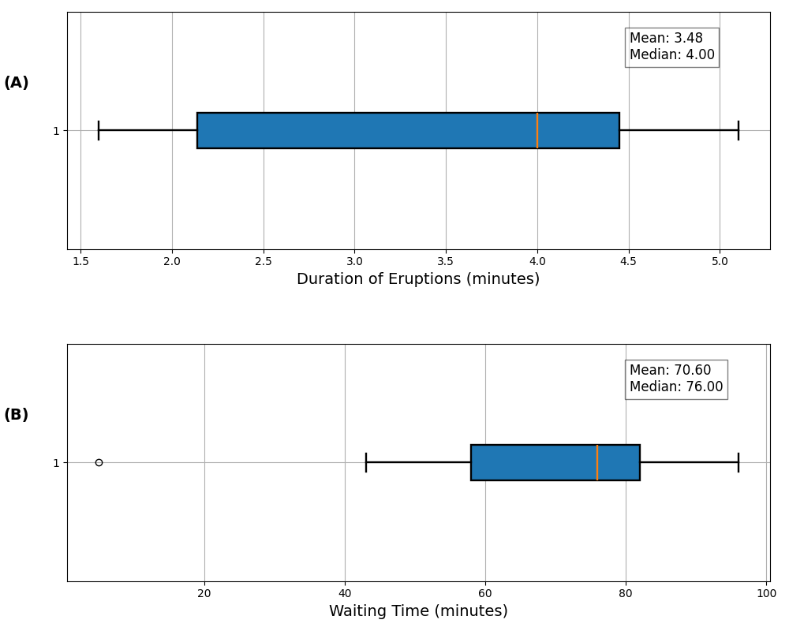

<h1 align="center">Data Analysis on Old Faithful Geyser</h1>
<h5 align="center">Codebase for Fall 2024 BMI 500 Coursework Week 4 Assignment at Emory University</h5>
<h5 align="center">Submitted by Swati Rajwal</h5>

<b>Figure 1: Data distribution of (A) geyser eruption duration and (B) wait time.</b>

## 🏃‍♂️Running the Analysis
1. The `hw4.py` is the main script containing all the code
2. The resultant figures are stored in `output/` directory. The code will create one if not available already.
3. Command to run the code: `python hw4.py`.
4. [Optional] I prefer to store my terminal results in a txt file for future reference. One can do so by running `python hw4.py | tee  output/output.txt`. The txt file will be stored in the `output/` directory as specified in the command. 
